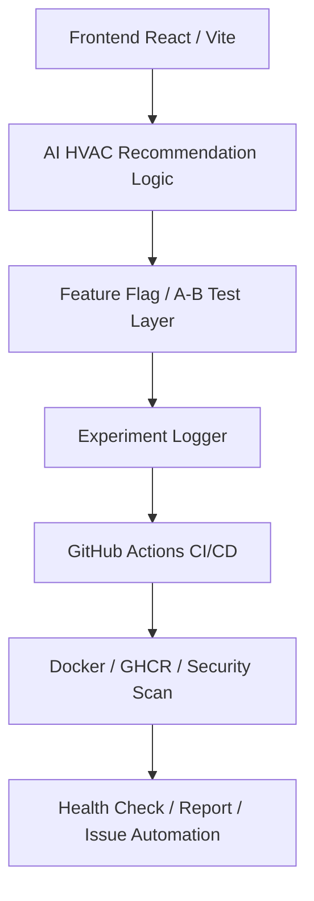

# ADR-001: Final Architecture Decision

## Status

Accepted

---

## Context

Edge VLM HVAC System은 AI 기반 HVAC 제어 추천, Feature Flag 실험, 테스트 자동화, CI/CD, 보안 스캔, 배포 전략을 모두 포함해야 한다.

프로젝트는 학습 및 실증 목적이므로 복잡한 클라우드 인프라보다 GitHub Actions, Docker, Vercel-ready frontend 구조를 중심으로 운영 가능성을 증명하는 것이 중요하다.

---

## Decision

본 프로젝트는 다음 아키텍처를 채택한다.

---

## Architecture Components

| 구성 요소 | 역할 |
|----------|------|
| Frontend React / Vite | 사용자 UI와 대시보드 제공 |
| AI HVAC Recommendation Logic | 센서 데이터 기반 HVAC 제어 추천 |
| Feature Flag / A-B Test Layer | 기능 토글과 실험군 할당 |
| Experiment Logger | 사용자 이벤트와 실험 로그 기록 |
| GitHub Actions CI/CD | 테스트, 빌드, 배포, 리포트 자동화 |
| Docker / GHCR / Security Scan | 컨테이너 이미지 빌드와 보안 검증 |
| Health Check / Report / Issue Automation | 운영 상태 확인과 장애/리포트 자동화 |

---

## 선택 이유

1. Vite + React는 빠르게 UI를 구성하고 테스트하기 쉽다.
2. Vitest는 Vite 환경과 잘 맞고 coverage 설정이 간단하다.
3. Playwright는 실제 브라우저 기반 E2E 테스트에 적합하다.
4. GitHub Actions는 테스트, 보안, 배포, 리포팅 자동화에 적합하다.
5. Docker와 GHCR은 컨테이너 배포 전략을 설명하기에 충분하다.
6. Feature Flag와 A/B 테스트 구조는 실험 기반 제품 개선에 적합하다.

---

## Consequences

### Positive

- CI/CD와 테스트 자동화가 명확하다.
- 실험 운영과 의사결정 기록이 문서화된다.
- 작은 프로젝트에서도 운영 관점의 구조를 갖출 수 있다.
- Feature Flag 기반으로 기능 출시와 실험을 안전하게 관리할 수 있다.
- 테스트와 보안 스캔을 통해 main 브랜치 안정성을 높일 수 있다.

### Negative

- 실제 VLM 모델 API 연동은 추후 과제로 남는다.
- 실제 클라우드 배포 URL은 별도 설정이 필요하다.
- 실시간 메트릭 수집은 GitHub Actions/문서 중심으로 제한된다.
- 실제 센서 데이터 기반 검증은 추가적인 하드웨어 연동이 필요하다.

---

## Alternatives Considered

| 대안 | 선택하지 않은 이유 |
|------|-------------------|
| Full Cloud Native Architecture | 과제 범위에 비해 복잡하고 비용이 발생할 수 있음 |
| Backend API 중심 구조 | 현재 MVP는 프런트엔드와 추천 로직 검증이 핵심임 |
| Manual Deployment | CI/CD 요구사항과 맞지 않음 |
| No Feature Flag | A/B 테스트와 실험 운영 요구사항을 충족하기 어려움 |

---

## Related Documents

- `docs/RUNBOOK.md`
- `docs/MODEL_CARD.md`
- `RETROSPECTIVE.md`
- `week13/README.md`
- `.github/workflows/final-quality-gate.yml`