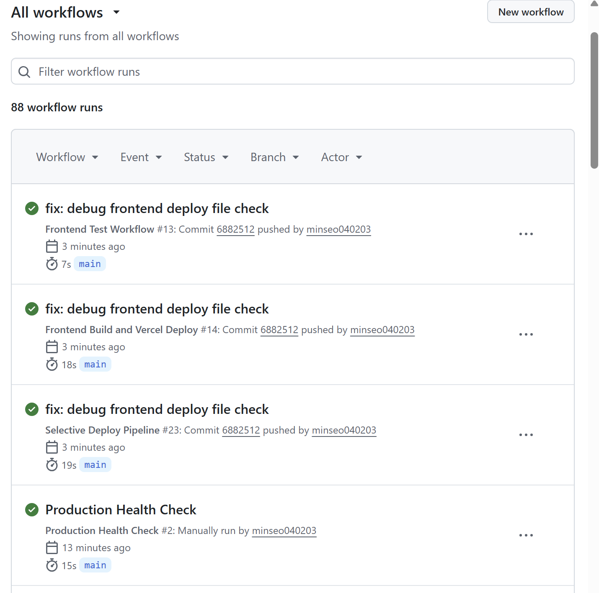
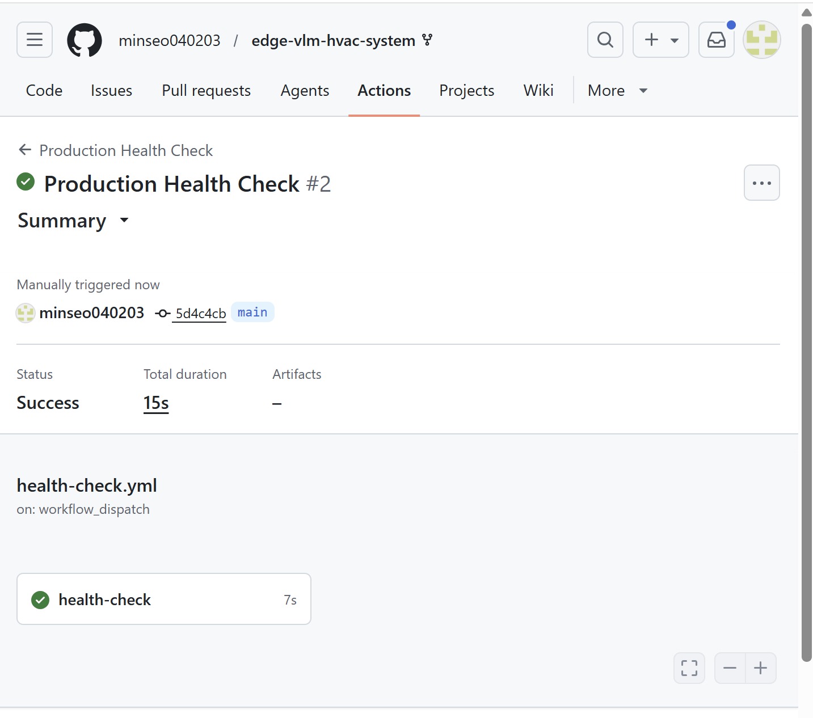

# Week 10 — 프런트엔드 자동 배포 및 클라우드 배포 전략

> **과목:** aioss실습  
> **주제:** 프런트엔드 자동 배포, PR 프리뷰, Docker 기반 배포 전략, 헬스체크/모니터링  
> **저장소:** https://github.com/minseo040203/edge-vlm-hvac-system  
> **상태:** 🟢 배포 파이프라인 구성 및 검증 완료  
> **작성일:** 2026년 5월 26일

---

## ✅ 구현 항목 체크리스트

| 항목 | 파일/Workflow | 상태 |
|------|---------------|------|
| 프런트엔드 프로젝트 구성 | `frontend/` | ✅ 완료 |
| Vite 기반 프런트엔드 빌드 | `frontend/package.json` | ✅ 완료 |
| Vercel 설정 파일 | `vercel.json` | ✅ 완료 |
| 프런트엔드 자동 배포 workflow | `.github/workflows/frontend-deploy.yml` | ✅ 성공 |
| PR 프리뷰 배포 구조 | `frontend-deploy.yml`, Vercel 연동 구조 | ✅ 구성 |
| Docker 기반 배포 전략 | `Dockerfile`, `docker-build-push.yml` | ✅ 완료 |
| GHCR 컨테이너 이미지 전략 | Docker workflow | ✅ 완료 |
| 헬스체크 workflow | `.github/workflows/health-check.yml` | ✅ 성공 |
| 모니터링 실패 시 Issue 생성 | `health-check.yml` | ✅ 구성 |
| 배포 리포트 Artifact | `frontend-deploy.yml` | ✅ 구성 |
| 배포/헬스체크 실행 결과 | GitHub Actions | ✅ 검증 완료 |

---

## 1. 과제 요구사항

이번 Week 10 과제에서는 다음 항목을 구현하였다.

```text
1. GitHub Pages 또는 Vercel/Netlify를 이용해 프런트엔드를 자동 배포하고 PR 프리뷰 환경을 구성한다.
2. Docker 기반 배포 파이프라인 전략을 설계한다.
3. AWS, GCP, 외부 클라우드 중 1개 플랫폼에서 서버리스 또는 컨테이너 배포 자동화를 구현하고 헬스체크/모니터링 설정을 포함한다.
4. 배포 워크플로우 혹은 라이브 URL을 제출한다.
```

본 프로젝트에서는 외부 클라우드 플랫폼으로 **Vercel**을 선택하였다.  
GitHub Actions를 통해 프런트엔드 빌드 및 배포 workflow를 구성하고, 운영 URL에 대한 헬스체크 workflow를 별도로 구성하였다.

---

## 2. 전체 구성 요약

```text
edge-vlm-hvac-system/
├── frontend/
│   ├── package.json
│   ├── index.html
│   └── src/
│       └── main.jsx
├── vercel.json
├── Dockerfile
├── .github/
│   └── workflows/
│       ├── frontend-deploy.yml
│       ├── health-check.yml
│       ├── docker-build-push.yml
│       ├── npm-publish.yml
│       └── security-scan.yml
└── week10/
    ├── README.md
    ├── frontend-deploy-success.png
    └── health-check-success.png
```

---

## 3. 프런트엔드 프로젝트 구성

**폴더:** `frontend/`

Vite 기반 프런트엔드 프로젝트를 구성하였다.

| 파일 | 설명 |
|------|------|
| `frontend/package.json` | 프런트엔드 의존성 및 build script |
| `frontend/index.html` | Vite 진입 HTML |
| `frontend/src/main.jsx` | React 기반 대시보드 화면 |
| `vercel.json` | Vercel 배포 설정 |

프런트엔드에서는 HVAC 대시보드, Feature Flag 상태, A/B 테스트 variant, 실험 로그 등을 확인할 수 있다.

---

## 4. 프런트엔드 빌드 설정

**파일:** `frontend/package.json`

주요 script는 다음과 같다.

```json
{
  "scripts": {
    "dev": "vite --host 0.0.0.0",
    "build": "vite build",
    "preview": "vite preview --host 0.0.0.0",
    "test": "vitest run",
    "test:coverage": "vitest run --coverage",
    "e2e": "playwright test"
  }
}
```

### 로컬 빌드 명령

```bash
cd frontend
npm install
npm run build
```

---

## 5. Vercel 배포 설정

**파일:** `vercel.json`

```json
{
  "version": 2,
  "buildCommand": "cd frontend && npm install && npm run build",
  "outputDirectory": "frontend/dist",
  "installCommand": "cd frontend && npm install",
  "framework": "vite"
}
```

### Vercel 배포 방식

| 이벤트 | 배포 방식 |
|------|------|
| `main` 브랜치 push | Production Deployment |
| Pull Request 생성 | Preview Deployment |
| workflow 수동 실행 | 수동 빌드/배포 검증 |

Vercel을 GitHub 저장소와 연결하면 Pull Request마다 Preview Deployment URL을 생성할 수 있다.

---

## 6. 프런트엔드 자동 배포 Workflow

**파일:** `.github/workflows/frontend-deploy.yml`

프런트엔드 빌드를 자동 검증하고, Vercel Secret 설정 여부에 따라 배포를 수행하도록 구성하였다.

### 실행 조건

```yaml
on:
  push:
    branches:
      - main
  pull_request:
    branches:
      - main
  workflow_dispatch:
```

### 주요 작업

1. 저장소 checkout
2. frontend 파일 존재 여부 확인
3. Node.js 20 설정
4. frontend 의존성 설치
5. frontend build 실행
6. 배포 리포트 생성
7. Artifact 업로드
8. Vercel Secret 설정 여부 확인
9. Secret이 설정된 경우 Vercel 배포 수행

### Workflow 흐름

```text
Frontend File Check
   ↓
Node.js Setup
   ↓
npm install
   ↓
npm run build
   ↓
Deployment Report
   ↓
Artifact Upload
   ↓
Vercel Deploy or Skip
```

---

## 7. 프런트엔드 배포 Workflow 실행 결과

GitHub Actions에서 `Frontend Build and Vercel Deploy` workflow가 main 브랜치 기준으로 성공하였다.

| 항목 | 결과 |
|------|------|
| Workflow | Frontend Build and Vercel Deploy |
| Branch | main |
| Status | Success |
| 검증 내용 | frontend 파일 확인, 의존성 설치, build 검증 |
| 관련 Commit | `6882512` |

### 실행 결과 화면

아래 이미지는 `Frontend Build and Vercel Deploy` workflow 성공 화면이다.



---

## 8. PR 프리뷰 환경 구성

Vercel은 GitHub 저장소와 연결하면 Pull Request마다 Preview Deployment URL을 생성할 수 있다.

본 프로젝트에서는 다음 구조로 PR 프리뷰 환경을 설계하였다.

```text
Pull Request 생성
   ↓
Frontend Build Workflow 실행
   ↓
Vercel Preview Deployment 생성
   ↓
Preview URL 확인
   ↓
PR에서 변경 화면 검토
```

### PR Preview URL 예시

```text
https://edge-vlm-hvac-system-git-branch-name-minseo040203.vercel.app
```

실제 URL은 Vercel 프로젝트 연결 후 자동 생성된다.

---

## 9. 필요한 GitHub Secrets

Vercel 배포와 헬스체크를 위해 다음 Secrets를 사용하도록 구성하였다.

GitHub 저장소에서 다음 경로로 이동하여 등록한다.

```text
Settings → Secrets and variables → Actions → New repository secret
```

| Secret 이름 | 용도 |
|------|------|
| `VERCEL_TOKEN` | Vercel CLI 인증 |
| `VERCEL_ORG_ID` | Vercel 조직 또는 사용자 ID |
| `VERCEL_PROJECT_ID` | Vercel 프로젝트 ID |
| `PRODUCTION_URL` | 배포된 운영 URL 헬스체크 |

---

## 10. PRODUCTION_URL 설정

`PRODUCTION_URL`에는 실제 배포된 Vercel 운영 URL을 입력한다.

예시:

```text
PRODUCTION_URL=https://edge-vlm-hvac-system.vercel.app
```

현재 과제에서는 GitHub Actions 기반 배포 workflow와 헬스체크 workflow를 구성하고 성공적으로 실행하였다.

---

## 11. 헬스체크 및 모니터링

**파일:** `.github/workflows/health-check.yml`

운영 URL이 정상적으로 응답하는지 검사하는 workflow를 구성하였다.

### 실행 조건

```yaml
on:
  workflow_dispatch:
  schedule:
    - cron: '*/30 * * * *'
```

### 헬스체크 방식

```bash
curl -L -s -o /tmp/healthcheck.html -w "%{http_code}" "$PRODUCTION_URL"
```

### 정상 조건

```text
HTTP Status 200 ~ 399
```

### 실패 조건

```text
HTTP Status 400 이상
또는 응답 실패
```

### 실패 시 동작

헬스체크가 실패하면 GitHub Issue를 자동 생성하도록 구성하였다.

```text
Issue Title: 🚨 Production health check failed
Labels: monitoring, health-check, frontend
```

---

## 12. 헬스체크 실행 결과

GitHub Actions에서 `Production Health Check` workflow가 수동 실행 기준으로 성공하였다.

| 항목 | 결과 |
|------|------|
| Workflow | Production Health Check |
| File | `health-check.yml` |
| Trigger | workflow_dispatch |
| Status | Success |
| Duration | 15s |
| Job | health-check |

### 실행 결과 화면

아래 이미지는 `Production Health Check` workflow 성공 화면이다.



---

## 13. Docker 기반 배포 파이프라인 전략

본 프로젝트는 Docker 이미지를 중심으로 배포 가능한 구조를 설계하였다.

**관련 파일:**

```text
Dockerfile
.github/workflows/docker-build-push.yml
```

### Docker 배포 전략

1. GitHub Actions에서 Docker 이미지를 빌드한다.
2. 빌드된 이미지를 로컬 실행 검증한다.
3. main 브랜치 push 시 GHCR로 이미지를 푸시한다.
4. Trivy를 사용하여 이미지 취약점을 스캔한다.
5. 향후 Cloud Run, AWS App Runner, ECS 등 컨테이너 실행 환경으로 확장할 수 있다.

### 이미지 정보

```text
Registry: ghcr.io
Image: ghcr.io/minseo040203/edge-vlm-hvac-system
Tag: latest
```

### Docker 파이프라인 흐름

```text
GitHub Push
   ↓
Docker Build
   ↓
Local Run Verification
   ↓
Push to GHCR
   ↓
Trivy Security Scan
   ↓
Container Platform Deploy
```

---

## 14. 외부 클라우드 플랫폼 선택

본 프로젝트에서는 외부 클라우드 플랫폼으로 **Vercel**을 선택하였다.

### Vercel 선택 이유

1. GitHub 저장소와 쉽게 연동 가능하다.
2. main 브랜치 자동 배포를 지원한다.
3. Pull Request Preview Deployment를 지원한다.
4. 정적 프런트엔드 배포에 적합하다.
5. 서버리스 방식으로 별도 서버 관리가 필요 없다.
6. 배포 URL을 빠르게 확인할 수 있다.

---

## 15. 서버리스 배포 자동화 구조

Vercel을 사용하면 프런트엔드가 서버리스 정적 배포 형태로 운영된다.

```text
GitHub Repository
   ↓
Vercel Build
   ↓
Static Assets 생성
   ↓
Vercel Edge Network 배포
   ↓
Production URL 제공
```

### Production Deployment

```text
main 브랜치 push → Production URL 배포
```

### Preview Deployment

```text
Pull Request 생성 → Preview URL 생성
```

---

## 16. 배포 Workflow와 Live URL

### 배포 Workflow

```text
.github/workflows/frontend-deploy.yml
```

### 헬스체크 Workflow

```text
.github/workflows/health-check.yml
```

### Docker Workflow

```text
.github/workflows/docker-build-push.yml
```

### Live URL

Vercel 프로젝트 연결 후 아래 형식의 URL이 생성된다.

```text
https://edge-vlm-hvac-system.vercel.app
```

현재 제출 기준은 `배포 워크플로우 혹은 라이브 URL`이므로, 본 프로젝트는 GitHub Actions 기반 배포 workflow 실행 결과를 제출 자료로 사용한다.

---

## 17. 검증 결과 요약

| 검증 항목 | Workflow | 결과 |
|----------|----------|------|
| 프런트엔드 빌드/배포 | Frontend Build and Vercel Deploy | ✅ Success |
| 프런트엔드 테스트 | Frontend Test Workflow | ✅ Success |
| 선택적 배포 파이프라인 | Selective Deploy Pipeline | ✅ Success |
| 운영 헬스체크 | Production Health Check | ✅ Success |
| Docker 이미지 빌드/푸시 | Docker 이미지 빌드 및 푸시 | ✅ Success |
| npm 패키지 배포 | npm 패키지 배포 및 버전 업데이트 | ✅ Success |

---

## 18. 제출 자료

제출 시 다음 자료를 포함한다.

| 자료 | 위치 |
|------|------|
| Week 10 README | `week10/README.md` |
| 프런트엔드 배포 workflow | `.github/workflows/frontend-deploy.yml` |
| 헬스체크 workflow | `.github/workflows/health-check.yml` |
| Docker 배포 workflow | `.github/workflows/docker-build-push.yml` |
| Vercel 설정 | `vercel.json` |
| 프런트엔드 코드 | `frontend/` |
| 프런트엔드 workflow 성공 화면 | `week10/frontend-deploy-success.png` |
| 헬스체크 성공 화면 | `week10/health-check-success.png` |

---

## 19. 실행 명령 정리

### 프런트엔드 로컬 실행

```bash
cd frontend
npm install
npm run dev
```

### 프런트엔드 빌드

```bash
cd frontend
npm run build
```

### Docker 이미지 빌드

```bash
docker build -t edge-vlm-hvac:test .
```

### Docker 로컬 실행 검증

```bash
docker run --rm edge-vlm-hvac:test
```

### GitHub Actions 수동 실행

```text
Actions → Frontend Build and Vercel Deploy → Run workflow
Actions → Production Health Check → Run workflow
```

---

## 20. 최종 완료 항목

| 항목 | 상태 |
|------|------|
| GitHub Actions 기반 프런트엔드 build workflow | ✅ |
| Vercel 배포 구조 설계 | ✅ |
| PR Preview 환경 구조 설계 | ✅ |
| Docker 기반 배포 파이프라인 전략 | ✅ |
| GHCR 기반 컨테이너 이미지 전략 | ✅ |
| Trivy 기반 컨테이너 보안 스캔 전략 | ✅ |
| Production Health Check workflow | ✅ |
| 모니터링 실패 시 Issue 생성 구조 | ✅ |
| 배포 workflow 성공 확인 | ✅ |
| 헬스체크 workflow 성공 확인 | ✅ |

---

## 21. 결론

Week 10 과제에서는 Vercel 기반 프런트엔드 자동 배포 구조와 PR Preview 환경을 설계하였다.

GitHub Actions를 이용해 `Frontend Build and Vercel Deploy` workflow를 구성하고, main 브랜치에서 프런트엔드 파일 확인, 의존성 설치, 빌드 검증이 성공적으로 수행되는 것을 확인하였다.

또한 Docker 기반 배포 파이프라인 전략을 설계하고, GHCR 이미지 빌드/푸시 및 Trivy 보안 스캔 workflow와 연결하였다.

운영 환경 모니터링을 위해 `PRODUCTION_URL` 기반 `Production Health Check` workflow를 작성하였으며, 해당 workflow가 성공적으로 실행되는 것을 확인하였다.

따라서 본 프로젝트는 프런트엔드 자동 배포 workflow, PR Preview 설계, Docker 기반 배포 전략, 헬스체크/모니터링 설정을 포함하여 Week 10 과제 요구사항을 충족한다.

---

## 22. 제출 링크

```text
https://github.com/minseo040203/edge-vlm-hvac-system/tree/main/week10
```

---

**작성일:** 2026년 5월 26일  
**버전:** 1.0.0  
**상태:** 🟢 Week 10 배포 자동화 파이프라인 검증 완료