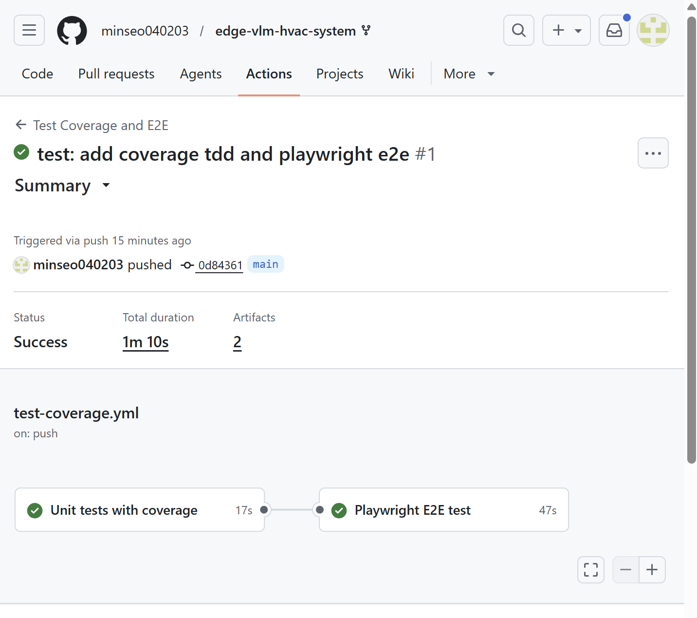

# Week 12 — Unit Test, TDD, Coverage, E2E

> **과목:** aioss실습  
> **주제:** 단위 테스트, TDD, 테스트 커버리지, Playwright E2E  
> **저장소:** https://github.com/minseo040203/edge-vlm-hvac-system  
> **상태:** 🟢 테스트 자동화 구성 완료  
> **작성일:** 2026년 5월 26일

---

## ✅ 구현 항목 체크리스트

| 항목 | 파일 | 상태 |
|------|------|------|
| 단위 테스트 도입 | `frontend/tests/unit/` | ✅ |
| 80% 이상 coverage 설정 | `frontend/vitest.config.js` | ✅ |
| CI 자동 테스트 실행 | `.github/workflows/test-coverage.yml` | ✅ 성공 |
| TDD 핵심 기능 5개 이상 | `frontend/src/core/hvacControl.js` | ✅ |
| Red-Green-Refactor 기록 | 본 README | ✅ |
| Playwright E2E 시나리오 | `frontend/tests/e2e/app.spec.js` | ✅ |
| 실패 시 스크린샷/비디오/Trace 저장 | `playwright.config.js`, CI Artifact | ✅ |
| 테스트 리포트 Artifact | `test-coverage.yml` | ✅ |
| CI 결과 캡처 | `week12/test-coverage-e2e-success.png` | ✅ |

---

## 1. 과제 요구사항

```text
1. 단위 테스트(Jest 등)로 80% 이상 커버리지를 달성하고 CI에 자동 실행한다.
2. TDD(Red-Green-Refactor) 사이클로 핵심 기능 5개 이상을 구현한다.
3. 선택과제로 Playwright 기반 E2E 시나리오 1개를 작성하고 실패 시 스크린샷 아티팩트를 저장한다.
4. 레거시 코드 테스트 보강 후 리팩토링 안정성을 검증한다.
5. 깃허브 링크로 테스트 코드와 CI 결과를 제출한다.
```

본 프로젝트에서는 Vite 기반 프런트엔드와 잘 맞는 **Vitest**를 사용하여 단위 테스트와 커버리지를 구성하였다.  
또한 Playwright를 사용하여 프런트엔드 주요 화면 흐름을 E2E로 검증하였다.

---

## 2. 구현 파일 구조

```text
frontend/
├── vitest.config.js
├── playwright.config.js
├── src/
│   ├── core/
│   │   └── hvacControl.js
│   ├── featureFlags.js
│   ├── experimentLogger.js
│   └── main.jsx
└── tests/
    ├── unit/
    │   ├── hvacControl.test.js
    │   ├── featureFlags.test.js
    │   └── experimentLogger.test.js
    └── e2e/
        └── app.spec.js

.github/
└── workflows/
    └── test-coverage.yml

week12/
├── README.md
└── test-coverage-e2e-success.png
```

---

## 3. 단위 테스트 및 커버리지

**설정 파일:** `frontend/vitest.config.js`

커버리지 기준을 80% 이상으로 설정하였다.

```javascript
thresholds: {
  statements: 80,
  branches: 80,
  functions: 80,
  lines: 80
}
```

### 테스트 실행 명령

```bash
cd frontend
npm install
npm run test:coverage
```

### Coverage Report

테스트 실행 후 다음 경로에 커버리지 리포트가 생성된다.

```text
frontend/coverage/
```

CI에서는 이 리포트를 Artifact로 저장한다.

```text
Artifact: frontend-coverage-report
```

---

## 4. TDD 핵심 기능 5개 이상 구현

**구현 파일:** `frontend/src/core/hvacControl.js`  
**테스트 파일:** `frontend/tests/unit/hvacControl.test.js`

다음 6개 핵심 기능을 TDD 방식으로 구현하였다.

| 기능 | 설명 |
|------|------|
| `validateSensorData` | 센서 데이터 유효성 검증 |
| `clampTemperature` | 목표 온도 범위 제한 |
| `calculatePmvScore` | 간단 PMV 점수 계산 |
| `determineHvacMode` | 냉방/난방/환기/대기/쾌적 모드 결정 |
| `calculateEnergySavingScore` | 에너지 절감 점수 계산 |
| `generateControlRecommendation` | HVAC 제어 추천 생성 |

---

## 5. Red-Green-Refactor 사이클 기록

### Cycle 1 — Sensor Validation

```text
Red: 잘못된 센서 데이터에 대한 실패 테스트 작성
Green: validateSensorData 최소 구현
Refactor: requiredFields 배열 기반 검증으로 정리
```

### Cycle 2 — Temperature Clamp

```text
Red: 18도 미만, 30도 초과 입력 테스트 작성
Green: clampTemperature 구현
Refactor: MIN/MAX 상수 분리
```

### Cycle 3 — PMV Score

```text
Red: 정상 센서 데이터와 고온 데이터 PMV 테스트 작성
Green: calculatePmvScore 구현
Refactor: 온도/습도/재실/CO2 가중치 분리
```

### Cycle 4 — HVAC Mode

```text
Red: standby, cooling, heating, ventilation, comfort 테스트 작성
Green: determineHvacMode 구현
Refactor: target temperature clamp 적용
```

### Cycle 5 — Energy Saving Score

```text
Red: 점수가 0~100 범위를 벗어나지 않는지 테스트 작성
Green: calculateEnergySavingScore 구현
Refactor: occupancy factor와 CO2 penalty 분리
```

### Cycle 6 — Recommendation

```text
Red: 추천 객체 구조와 메시지 테스트 작성
Green: generateControlRecommendation 구현
Refactor: mode별 메시지 맵으로 정리
```

---

## 6. 레거시 코드 테스트 보강

Week 11에서 작성한 Feature Flag와 Experiment Logger 코드를 테스트로 보강하였다.

### Feature Flag 테스트

**파일:** `frontend/tests/unit/featureFlags.test.js`

검증 항목:

```text
- 기본 사용자 반환
- query string 사용자 파싱
- localStorage 기반 데모 사용자 저장
- 대상 사용자 feature 활성화
- 비활성화된 feature flag 유지 검증
- feature flag state 반환
- 사용자별 A/B 테스트 variant 일관성
```

### Experiment Logger 테스트

**파일:** `frontend/tests/unit/experimentLogger.test.js`

검증 항목:

```text
- 이벤트 localStorage 저장
- 여러 이벤트 append
- 이벤트 로그 초기화
```

이 테스트를 통해 기존 Feature Flag/A/B 테스트 코드의 리팩토링 안정성을 검증하였다.

---

## 7. Playwright E2E 테스트

**설정 파일:** `frontend/playwright.config.js`  
**테스트 파일:** `frontend/tests/e2e/app.spec.js`

### E2E 시나리오

최종 E2E 테스트는 항상 화면에 표시되는 안정적인 UI 요소를 기준으로 작성하였다.

```text
1. admin 사용자 쿼리 파라미터로 접속
2. 메인 대시보드 제목 확인
3. 현재 사용자 영역 확인
4. Feature Flags 영역 확인
5. A/B Test Assignments 영역 확인
6. Admin / Operator / Guest 사용자 버튼 확인
7. Experiment Event Log 영역 확인
8. 로그 초기화 버튼 확인
```

### 실행 명령

```bash
cd frontend
npm run e2e
```

### 실패 시 Artifact

Playwright 설정에서 실패 시 다음 자료를 저장한다.

```text
- screenshot
- video
- trace
- HTML report
```

CI에서는 아래 Artifact로 업로드한다.

```text
Artifact: playwright-report
```

---

## 8. CI 자동 실행

**파일:** `.github/workflows/test-coverage.yml`

### 실행 조건

```text
main 브랜치 push
pull_request
workflow_dispatch
```

### CI Job 구성

| Job | 설명 | 결과 |
|------|------|------|
| `unit-test-coverage` | Vitest 단위 테스트 및 coverage 측정 | ✅ 성공 |
| `playwright-e2e` | Playwright E2E 테스트 실행 | ✅ 성공 |

### CI 흐름

```text
Push / PR
   ↓
Checkout
   ↓
Node.js 20 설정
   ↓
npm install
   ↓
Vitest coverage
   ↓
Coverage Artifact 업로드
   ↓
Playwright browser 설치
   ↓
E2E 실행
   ↓
Playwright report Artifact 업로드
```

### CI 실행 결과

GitHub Actions에서 `Test Coverage and E2E` workflow가 성공하였다.

```text
Workflow: Test Coverage and E2E
Status: Success
Duration: 1m 10s
Artifacts: 2
Jobs:
  - Unit tests with coverage
  - Playwright E2E test
```



---

## 9. GitHub 제출 링크

| 항목 | 링크 |
|------|------|
| TDD 핵심 기능 코드 | https://github.com/minseo040203/edge-vlm-hvac-system/blob/main/frontend/src/core/hvacControl.js |
| 단위 테스트 코드 | https://github.com/minseo040203/edge-vlm-hvac-system/tree/main/frontend/tests/unit |
| Feature Flag 테스트 | https://github.com/minseo040203/edge-vlm-hvac-system/blob/main/frontend/tests/unit/featureFlags.test.js |
| Experiment Logger 테스트 | https://github.com/minseo040203/edge-vlm-hvac-system/blob/main/frontend/tests/unit/experimentLogger.test.js |
| Playwright E2E 테스트 | https://github.com/minseo040203/edge-vlm-hvac-system/blob/main/frontend/tests/e2e/app.spec.js |
| Vitest 설정 | https://github.com/minseo040203/edge-vlm-hvac-system/blob/main/frontend/vitest.config.js |
| Playwright 설정 | https://github.com/minseo040203/edge-vlm-hvac-system/blob/main/frontend/playwright.config.js |
| CI Workflow | https://github.com/minseo040203/edge-vlm-hvac-system/blob/main/.github/workflows/test-coverage.yml |
| Week 12 README | https://github.com/minseo040203/edge-vlm-hvac-system/blob/main/week12/README.md |

---

## 10. 로컬 검증 명령

### 단위 테스트

```bash
cd frontend
npm install
npm run test
```

### Coverage 확인

```bash
cd frontend
npm run test:coverage
```

### E2E 테스트

```bash
cd frontend
npx playwright install
npm run e2e
```

---

## 11. 완료된 기능

- [x] Vitest 기반 단위 테스트 구성
- [x] Coverage threshold 80% 설정
- [x] CI에서 단위 테스트 자동 실행
- [x] TDD 핵심 기능 6개 구현
- [x] Red-Green-Refactor 사이클 문서화
- [x] Feature Flag 레거시 코드 테스트 보강
- [x] Experiment Logger 레거시 코드 테스트 보강
- [x] Playwright E2E 시나리오 작성
- [x] 실패 시 screenshot/video/trace 저장
- [x] CI Artifact 업로드 구성
- [x] GitHub Actions `Test Coverage and E2E` 성공 확인

---

## 12. 결론

Week 12 과제에서는 Vitest를 사용하여 단위 테스트와 80% 이상 coverage 기준을 구성하였다.

TDD 방식으로 HVAC 제어 핵심 기능 6개를 구현하고, Week 11에서 작성한 Feature Flag 및 Experiment Logger 레거시 코드에 테스트를 보강하였다.

또한 Playwright 기반 E2E 시나리오를 작성하여 프런트엔드 화면 흐름을 검증하고, 실패 시 screenshot, video, trace, HTML report를 Artifact로 저장하도록 CI를 구성하였다.

최종적으로 GitHub Actions의 `Test Coverage and E2E` workflow에서 `Unit tests with coverage`와 `Playwright E2E test` 두 job이 모두 성공하였다.

---

**작성일:** 2026년 5월 26일  
**버전:** 1.0.0  
**상태:** 🟢 테스트 자동화 및 TDD 구성 완료